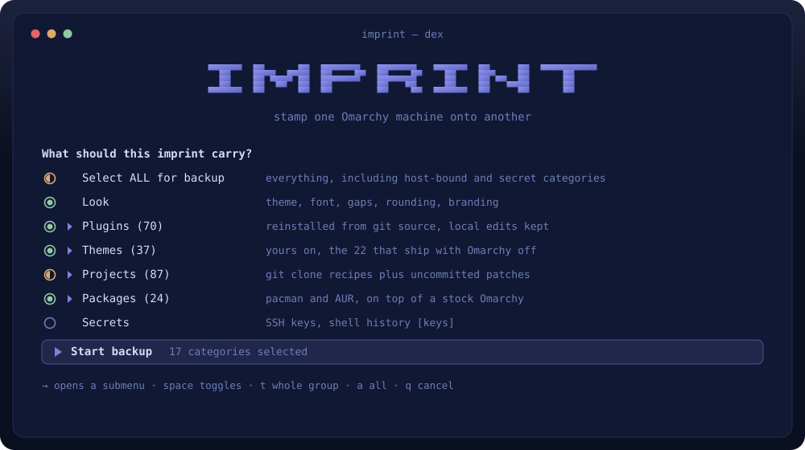
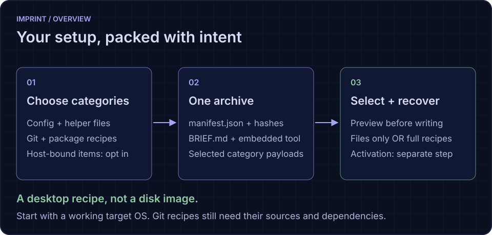
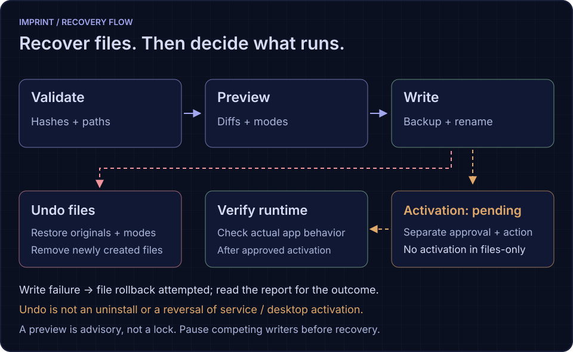
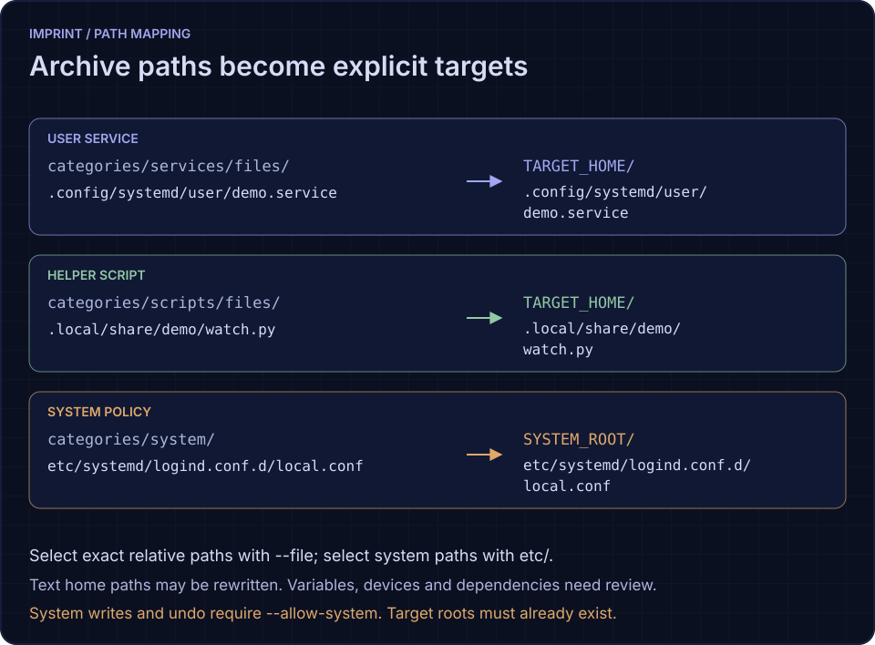
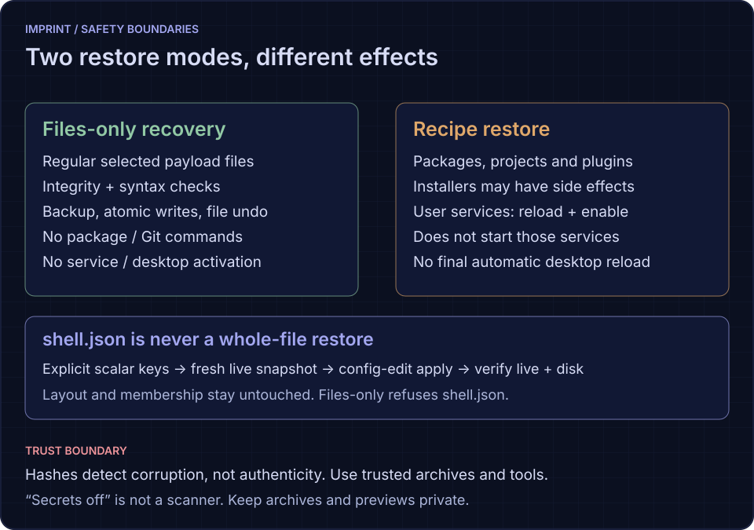
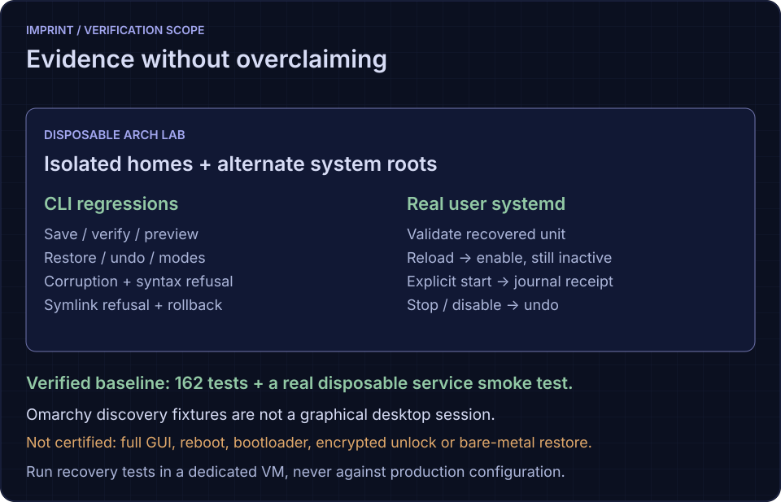

<div align="center">



<sub>Illustrative picker. Counts vary; private SSH keys are never collected.</sub>

<p>
  <a href="https://github.com/nixfred/imprint"></a>
  <a href="#tests"></a>
  
  
</p>

</div>

# Imprint

**Stamp one Omarchy machine onto another.**

Imprint writes a single archive of the desktop personality — theme, bar,
plugins, bindings, extra packages, user scripts, services — then restores
it onto a new box or an existing one. You pick what travels.

Software is saved as a **recipe, not a payload**: plugins and themes that have
a git remote are recorded as URLs and reinstalled from source on restore.

[Install](#install) · [Use](#use) · [Selective recovery](#selective-configuration-recovery) ·
[Safety](#choose-the-right-restore-mode) · [Archive format](#archive-layout) · [Tests](#tests)



> **A desktop recipe, not bare-metal recovery.** Start with a working target OS.
> Restore only archives you trust; hashes detect corruption, not authenticity.
> Use **files-only** when you want configuration recovery without activation.

```bash
imprint
imprint save
imprint restore ~/imprints/imprint-dex-20260906-1712.tar.zst
```

## Why this exists

Omarchy’s own story is: install from the ISO, then keep `~/.config` however
you like. Stow is the documented backup. Snapshots restore root, not home.
Atmos export covers *settings* (gaps, theme name, bindings), not plugins,
packages, or the bar layout.

Other people already built nearby tools. None of them is this:

| Tool | What it is | What it is not |
| --- | --- | --- |
| [OmaVault](https://github.com/mutahir/omavault) | File-level config snapshots | Does not reinstall plugins from git or extra packages |
| [Config Sync](https://github.com/gladimdim/omarchy-config-sync-plugin) | Private git repo of configs | Needs a git remote; not a single file you hand someone |
| [Time Machine](https://github.com/jankeesvw/omarchy-time-machine) | restic of `$HOME` | Whole-home backup, not a selectable desktop recipe |
| [Omarchy Guard](https://github.com/duclucky/omarchy-guard) / [Rollback](https://github.com/TadejPolajnar/omarchy-rollback) | Undo after an update | Same machine, not a new one |
| [Session restore](https://github.com/wbarakat/omarchy-session-restore) | Open windows across reboot | Not configs |
| [Atmos](https://github.com/csfh/atmos) import/export | Readable settings Markdown | No plugins, no packages, no bar widgets |
| [Discussion #5588](https://github.com/basecamp/omarchy/discussions/5588) | Proposed `omarchy backup` | Not shipped |

Imprint is the missing piece: **one file, category picker, plugin reinstall
from git, extra packages, `$HOME` rewrite, AI-readable brief.**

## Install

```bash
git clone https://github.com/nixfred/imprint.git
cd imprint
./install.sh
```

That links `imprint` into `~/.local/bin`. It needs `python3` (3.14+, for
`tarfile`'s zstd support) and `tar` — both already on an Omarchy box. There is
no dependency on `gum`; the menus, pickers and prompts are built in.

## Use

Run `imprint` for the menu. It clears the screen and puts the OMARCHY wordmark
at the top, with IMPRINT under it in the same block font.

**In the picker, `space` toggles the highlighted row.** A row marked `▸` has a
submenu — `space` opens it and `←` goes back, so you can pick individual
plugins, projects, packages, themes or scripts rather than whole categories.
The first row, **Select ALL for backup**, turns everything on or off at once.

```
 ◐ Select ALL for backup     everything, including the host-bound and secret categories
 ◉ Look                      Theme, font, gaps, rounding, branding
 ◉ Plugins (70) ▸            Reinstalled from git source; only local-only trees are packed
 ◉ Projects (87) ▸           Your git checkouts as clone recipes plus uncommitted patches
 ○ Monitors                  This machine's display layout  [this machine]
```

`◉` all, `○` none, `◐` some of the submenu.

**Nothing starts until you say so.** Space and enter both just act on the row
under the cursor, so selecting everything selects everything and leaves you
there to keep editing. The run begins only when you pick the last row:

```
   ▶ Start backup   14 categories selected
```

`→` opens the submenu under the cursor, or moves down when the row has none;
`←` backs out of a submenu, or moves up. `esc` also backs out. Other keys:
`t` toggles a whole group, `a` all, `n` none, `q` cancels.

Colours come from your active Omarchy theme's `colors.toml`, so the picker and
the progress output match the rest of the desktop. The header and submenu arrows
take the theme's accent, body text its foreground, hints and breadcrumbs its
muted colour, and the marks their state: `◉` in the theme's green, `◐` in its
orange, `○` muted. The cursor sits on the theme's own selection colour — unless
that theme's selection is too close to its background to see, or too dark to
read against, in which case the row falls back to reverse video.

`imprint palette` shows the whole mapping, including which key each colour
actually came from and what it fell back to:

```
theme Ethereal
  /home/pi/.config/omarchy/themes/ethereal

  ████  accent     #7d82d9   accent
  ████  amber      #eb8b54   orange
  ████  grey       #6d7db6   muted
  ████  selection  #252e56   selection

  picker cursor: the theme's selection colour
```

On a 256-colour terminal each one lands on the nearest of the 240 addressable
colours, weighted for how the eye reads the channels. The terminal's own low 16
are left out on purpose: those are whatever your terminal calls "blue", not what
the theme does.

```
imprint save                         # picker, writes to wherever the last one went
imprint save --only look,bar,plugins
imprint save --all -o /mnt/usb/dex.imprint.tar.zst

imprint restore FILE                 # picker of what is in that file
imprint restore FILE --only bar,plugins --dry-run
imprint restore FILE --only identity --confirm-hostname dex
imprint restore FILE --upgrade       # omarchy update -y first, abort if it fails
imprint restore FILE --only system --allow-system   # /etc + systemctl enable, via sudo
mkdir -p /tmp/try && imprint restore FILE --only system --allow-system --system-root /tmp/try

imprint plan FILE                    # write a restore.sh you can read before running
imprint plan FILE --only plugins -o ~/myplan

imprint info FILE                    # machine brief; feed this to an agent
imprint diff FILE                    # what drifted since the imprint
imprint verify FILE
imprint facts                        # this machine as JSON, for scripts and agents
imprint undo                         # last restore’s safety copy
imprint list
```

**It saves where you saved last.** The first archive lands in `~/imprints`.
After that, wherever you send one — an external disk, a Google Drive mount, a
second laptop over sshfs — is where the next `imprint save` goes, and what the
save prompt fills in for you. `imprint about` names the directory, and `imprint
list` and the restore picker look there too.

If that directory is gone when you come back to it, because the disk is
unplugged or the remote is not mounted this morning, the save says so and falls
back to `~/imprints` rather than writing into an empty mountpoint that looks
like it worked. It is remembered in `~/.local/state/imprint/state.json`; delete
that file to start over.

The archive is self-contained. On a fresh Omarchy install you can extract it
and run `tool/imprint restore .` without installing Imprint first. Do this only
for a trusted archive: its embedded tool is executable code. Git recipes and
package installs still need their upstream sources and dependencies.

## What a run looks like

Illustrative terminal output (names, counts and timings vary):

```
Collecting dex

  ✓ Look                               10.1 KB
  ✓ Plugins                            5.0 MB
  ✓ CLI configs                        59.1 KB

  Wrote /home/pi/imprints/imprint-dex-20260907-1013.tar.zst
  2.9 MB · 3 categories · 2.2s
```

A progress bar tracks the current item on a line that each finished item
overwrites, so you get a live bar while it works and a tidy checklist when it
is done. Colour is dropped when stdout is not a terminal or `NO_COLOR` is set,
and the machine-readable JSON is printed only when piped or asked for with
`--json` — a person watching has already seen the result.

## Selective configuration recovery



For verified payload recovery without installing packages or activating services:

```sh
imprint save --only services,scripts --include-file .local/share/my-helper/watch.py -o config.tar.zst
imprint verify config.tar.zst
imprint preview config.tar.zst --only services,scripts --files-only --file .local/share/my-helper/watch.py --json
imprint restore config.tar.zst --only services,scripts --files-only --file .local/share/my-helper/watch.py
```

Use `--target-home /existing/disposable/home` and `--system-root /existing/root`
for isolated rehearsals. System writes also need `--allow-system`. New archives
record content hashes and modes, and files-only recovery verifies them before
atomic writes with backup/undo and failure rollback. Service activation is
separate. **[Read the path mapping, privileges, examples and limits](docs/recovery.md).**

### From archive path to host path



`--only` is required in files-only mode. Repeat `--file` to recover exact paths;
omit it to consider all regular payload files in the selected categories.
Preview with the same target arguments before restoring. Source-home paths in
bounded UTF-8 text can be rewritten, but devices, IPs, dependencies and other
machine-specific values need manual review. A preview is not a lock on concurrent
writers. Keep previews private and pause competing writers before recovery.

### Choose the right restore mode



| Goal | Use | Important boundary |
| --- | --- | --- |
| Recover reviewed config or a helper | `restore FILE --only services,scripts --files-only` | No package, Git, service, desktop or scheduling commands |
| Rebuild packages, projects or plugins | `restore FILE --only packages,projects,plugins` | Recipe installers can have side effects; this is not files-only |
| Recover an allowed system file | `restore FILE --only system --files-only --allow-system --file etc/PATH` | Real `/etc` needs privileges; use an existing alternate `--system-root` for rehearsal |
| Recover one shell setting | `restore FILE --only bar --shell-key /idle/enabled` | Fresh live scalar merge; no layout/membership replacement |
| Reverse a files-only write | `undo --target-home TARGET_HOME --undo-dir DIR_FROM_REPORT` | Restores originals and removes new files, not external activation effects |

**Installed is not running.** `daemon-reload` rereads service definitions;
`enable` changes future startup; `start` runs a stopped service; `restart`
interrupts a running one. Files-only does none of them. After reviewing the
recovered files and dependencies, activate separately with approval and verify
actual runtime behavior. See the [service activation checklist](docs/recovery.md#installed-is-not-activated).

## Restoring

`imprint restore` walks you through it:

1. pick the archive
2. choose what to bring over, in the same picker as save — categories with a
   `▸` open into their contents, so you can take two plugins and leave the rest
3. **it tells you exactly what will change**, then asks

```
This restore will change:

  overwrite existing files  (4)
      ~/.config/omarchy/server-status.json
      ~/.config/omarchy/workspace-names.json
      …

  move plugins to another commit  (1)
      nixfred.workspace-names d6dbb683→176dfc84

  17 categories · 1671 files already identical

  Apply these changes to this machine? [y/N]
```

Files already identical are counted, not listed — the difference between
"rewrites 4 files" and "rewrites 1671" is the whole point. Destructive items
(disabling a plugin you have on, renaming the machine) are called out in red.

`imprint preview FILE` shows the same thing and stops, changing nothing.

## Read it before you run it

`imprint plan FILE` extracts the archive and writes a `restore.sh` next to it —
an ordered, commented shell script of exactly what a restore would do, with
nothing hidden inside the tool. Same recipe `imprint restore` follows, in a form
you can read, edit, or hand to someone else.

```
### preflight   is this an Omarchy box, is the shell answering
### upgrade     omarchy update -y, before anything is installed onto it
### packages    omarchy pkg add / pkg aur add
### toolchains  mise install, go install, cargo install
### projects    git clone each checkout, then apply its uncommitted patch
### plugins     plugin add, checkout the recorded branch/commit, reapply local
                edits, install the systemd units a widget needs
### files       copy the config trees into place
### activate    enable/disable plugins where the source had them
```

`imprint apply DIR` runs that same plan step by step, writing a `journal.json`
beside it after every one, so an interrupted run is resumable:

```bash
imprint plan  ~/backups/imprint-dex.tar.zst -o ~/myplan
imprint apply ~/myplan                 # run it
imprint apply ~/myplan --resume        # continue after a failure or a kill
imprint apply ~/myplan --recheck       # re-run steps already recorded as done
imprint apply ~/myplan --dry-run       # list the steps, execute nothing
```

`--resume` skips steps recorded as succeeded, retries anything that failed or was
left mid-flight by a kill, and re-runs any step whose body changed since it last
succeeded — so editing the plan and resuming does the right thing. The plan
directory can be moved or copied to another machine: payload paths go through
`$PLAN_PAYLOAD` instead of being baked in.

Every step runs in a `set -e` subshell, so a failure is real and gets listed by
name at the end rather than swallowed. Steps that may legitimately fail end in
`|| true`. The script exports the desktop session variables first: without them
the omarchy CLI cannot find its own share directory and every `plugin enable` is
a silent no-op.

The system layer is deliberately not inlined — it needs root, so the plan points
you at `imprint restore FILE --only system --allow-system`.

## What it carries

On by default (review for private data and target compatibility):

- **Look** — theme name, font, gaps, branding
- **Hyprland** — bindings, autostart, extra Lua (not monitors/input)
- **Bar and shell** — captures `shell.json` layout, idle and disabled plugins;
  restore merges only explicitly selected scalar settings, not layout/membership
- **Plugins** — git-backed plugins are recorded as URLs and reinstalled from
  source; only plugins with no upstream are packed as trees. Uncommitted local
  edits ride along as a small overlay and are reapplied after the clone
- **Projects** — every git checkout under `~/Projects` and `~/Work` as
  `git clone URL -b BRANCH`, plus a patch of anything uncommitted. Repos with
  no remote are listed as **not recoverable**, loudly
- **Toolchains** — `mise` config and resolved versions, `go install` module
  paths, `cargo install` crates, global npm packages — as commands, not binaries
- **System layer** — your `/etc` changes (systemd drop-ins, ufw rules, sshd
  policy, pacman config, docker daemon) and the list of enabled system units.
  Off by default and never applied without `--allow-system`; credentials, host
  keys and wifi secrets are never collected
- **Themes** — every theme on the machine. Yours are on by default; the stock
  ones that ship with Omarchy are listed but off, and are only packed if you
  pick them
- **Fonts and icons** — your own fonts, icon themes and cursors, so a restored
  machine can honour the icon/cursor theme dconf asks for
- **Home documents** — hand-written notes at the top of `~` (`AGENTS.md`, wish
  lists) that nothing else backs up
- **Other app configs** — the long tail of `~/.config` no other category claims.
  Browser profiles, credential stores and anything over 8 MB are skipped, and
  every skip is reported with its reason
- **Hooks and menu**
- **Terminals**
- **Defaults** — MIME, browser, editor, agent
- **Packages** — extra pacman/AUR on top of the Omarchy ISO lists
- **Scripts** — text scripts in `~/bin` and `~/.local/bin` (not 20MB binaries)
- **User services** — units you added under `~/.config/systemd/user`
- **CLI configs** — starship, git, btop, lazygit, XCompose, bashrc

Off unless you turn them on:

- **Wallpaper overlays** (often hundreds of megabytes)
- **Web apps**, **Neovim**
- **Monitors**, **pointer/keyboard** (host-bound)
- **Identity** (hostname only, extra confirm on restore)
- **Secrets** (SSH public material/config, shell histories and `~/.config/gh`, which may include authentication tokens; private SSH keys stay put)

Not a full-machine backup: disk encryption/TPM, browser profiles and most private
application state are outside the intended scope. **Secrets off is not a secret
scanner**: ordinary configuration and scripts can contain inline credentials.
Review payloads and keep archives private. The system category can carry sshd
policy drop-ins, but not host keys or credentials.

On restore, `/home/olduser` inside text files becomes the new `$HOME`. Git
remotes of the form `git@github.com:...` are saved as `https://` so the new
box does not need your SSH key. Plugins land before `shell.json`, so the bar
has somewhere to put them.

`--system-root DIR` applies the system layer into another root instead of `/`.
For recipe system restore it uses `systemctl --root` to enable units offline;
a writable alternate root needs no privileges. This isolates **system operations
only**, not other selected recipe categories. Files-only system recovery writes
files without enablement. Do not treat `--system-root` alone as a full sandbox.

Afterwards every unit is checked with `systemctl is-enabled`. A unit whose file
is absent (its package never installed) or that failed to enable is reported as
a failure, because the generated script logs those to stderr and carries on.

The system layer never touches `/etc` on its own. It stages the files under
`~/.local/state/imprint/system-<stamp>/` and writes a `restore-system.sh` you
can read; only `--allow-system` runs it, and only through `sudo -n`.

`shell.json` is never restored wholesale. Bar restore requires explicit
`--shell-key /object/scalar` arguments, merges those settings into a fresh live
snapshot, uses `config-edit apply` without a layout override, and verifies live
and saved state. Layout/membership and whole objects/arrays are refused. A failed
snapshot is not permission to overwrite the file. Generated plans exclude it;
legacy undo containing it requires manual selective recovery. See
[the shell recovery contract](docs/recovery.md#shell-settings-never-a-whole-stale-snapshot).

File recovery stores originals under `TARGET_HOME/.local/state/imprint/undo-<time>`.
`imprint undo --target-home TARGET_HOME` restores them and removes new files when
using a files-only journal. Legacy recipe undo only restores saved originals;
it does not reverse installations, service enablement, or other external effects.
Final automatic desktop reload/restart is no longer performed. Ordinary services
restore uses daemon-reload and enable, without starting services; files-only
performs neither and reports activation pending.

## What else it can do

- **Dry-run restore** — print the plan, change nothing
- **Diff** — see what drifted after you lived on the new box
- **Brief** — Markdown an agent can follow without the archive
- **Verify** — schema, categories and content integrity for new archives
- **Undo** — saved file originals; files-only journals also remove new files
- **Self-extracting tool** — the archive carries `imprint` itself
- **Remembers where you save** — the next archive goes where the last one went
- **About** — `imprint about` for the version, the repo and
  [nixfred.com](https://nixfred.com); `imprint --version` when you want the
  number alone. Every archive records the version that wrote it, in
  `manifest.json` and at the top of `BRIEF.md`.

It will not clone disk encryption, lock policy, or another machine’s TPM.

## When a file gets in the way

Paths are checked before any work starts, not after, and **imprint never
creates a directory you named**. A tree of empty directories in a place nobody
meant to write to is not a fix for a typo, so a path that is not there stops
the run and says where the name stopped being real:

```
$ imprint save -o /home/google/imprints/imprint-dex.tar.zst
no such directory: /home/google/imprints
the deepest part that exists is /home
did you mean /home/pi/google/imprints ?
imprint does not create directories -- make it first:
  mkdir -p /home/google/imprints
```

The one directory imprint makes for itself is the one it chooses when you give
no path at all: `~/imprints` for a save, `~/.local/state/imprint/plan-<stamp>`
for a plan. Restoring still creates directories under `$HOME` — that is the
job. An archive that is not there, a plan directory with no plan in it and a
selection file that is really a directory each answer the same way.

Once a run is underway, one bad file never costs the rest of it:

- A file that cannot be read is left out, and the archive says so — the count
  and the reasons land in `manifest.json` and in a section of `BRIEF.md`, so
  whoever restores it knows what is not there.
- Recipe restore reports and steps over unwritable files, so it can leave a
  partial result; its nonzero exit code identifies the failure. Files-only
  recovery instead attempts file rollback and reports whether it succeeded.
- A write that dies partway takes its `.partial` file with it. Half an archive
  on a slow mount looks exactly like a backup.
- No command imprint runs can hold it open. Every child gets a timeout, an
  output cap enforced while it runs, and a process-group kill if it passes
  either. A save asks ninety git checkouts three questions each and talks to a
  shell that may not be running; one wedged child used to stall the whole run.
  A git command that does not answer is recorded as unknown, never read as
  "nothing to commit".
- Archive content goes into `$HOME` through a descriptor-relative walk, with
  containment verified at every hop, so a symlink appearing between the check
  and the write cannot redirect it out of your home directory.
- A staging disk that fills is the one thing that does stop a save, because
  skipping thousands of files would write a plausible archive with most of the
  machine missing from it. Point `TMPDIR` at a bigger disk and run it again.

## Archive layout

```
manifest.json          # kind=omarchy-imprint, imprint version, host, omarchy, categories
BRIEF.md               # human/agent readable
tool/imprint
tool/imprint-engine.py
categories/<id>/meta.json
categories/<id>/files/...
categories/plugins/trees/<plugin-id>/     # local-only plugins; git ones are URLs
```

## Credit

Two techniques here come from
[omarchy-config-sync-plugin](https://github.com/gladimdim/omarchy-config-sync-plugin)
(MIT, © 2026 Dmytro Gladkyi), rewritten for imprint and credited at the code:
its bounded subprocess runner, and its descriptor-relative containment for
writes into a live home directory.

## Tests



**Verified baseline:** 162 tests passed in disposable Arch VM 106 (`imprint-lab`)
on Hive, plus a real user-systemd recovery smoke test. The badge above records
that baseline; it is not a live CI status. No real Omarchy GUI session was verified.

```bash
python3 -m unittest discover -s tests  # installed Omarchy discovery required
python3 tests/run_suite.py             # portable discovery fixtures, real filesystem/Git/systemd
```

Run tests in a disposable VM, not the production desktop. The opt-in
`IMPRINT_DEDICATED_VM=1 python3 tests/vm_service_smoke.py` is restricted to the
`imprint-lab` VM and exercises a real disposable user service. Omarchy command
fixtures do not establish a working graphical shell.
